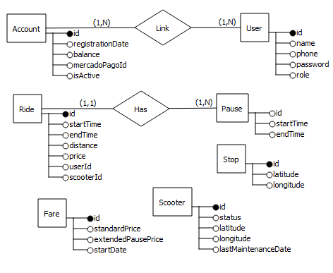

# Modelado de micro-servicios (domain-driven desing)

## Accounts Service

### Subdominios implicados

- Accounts
- Users

 ### Funcionalidades

 - ABM Cuenta
 - Asociar cuenta a Mercado Pago
 - Cargar dinero en la cuenta
 - Asociar usuario

 - ABM Usuario
 - Anular usuario
 - Asociar cuenta

## Scooters Service

### Subdominios implicados

- Scooters
- Stops

### Funcionalidades

- ABM Monopatines (incluye registro de mantenimientos)
- ABM Paradas
- Generación de reportes de monopatines

## Rides Service

### Subdominios implicados

- Rides
- Pauses

### Funcionalidades

- Registrar viajes
- Registrar pausas

## Fares Service

### Dominio implicado

- Fares

### Funcionalidades

- Establecer tarifa normal y extra (post pausa extendida)

# Diagrama de entidad y relaciones

